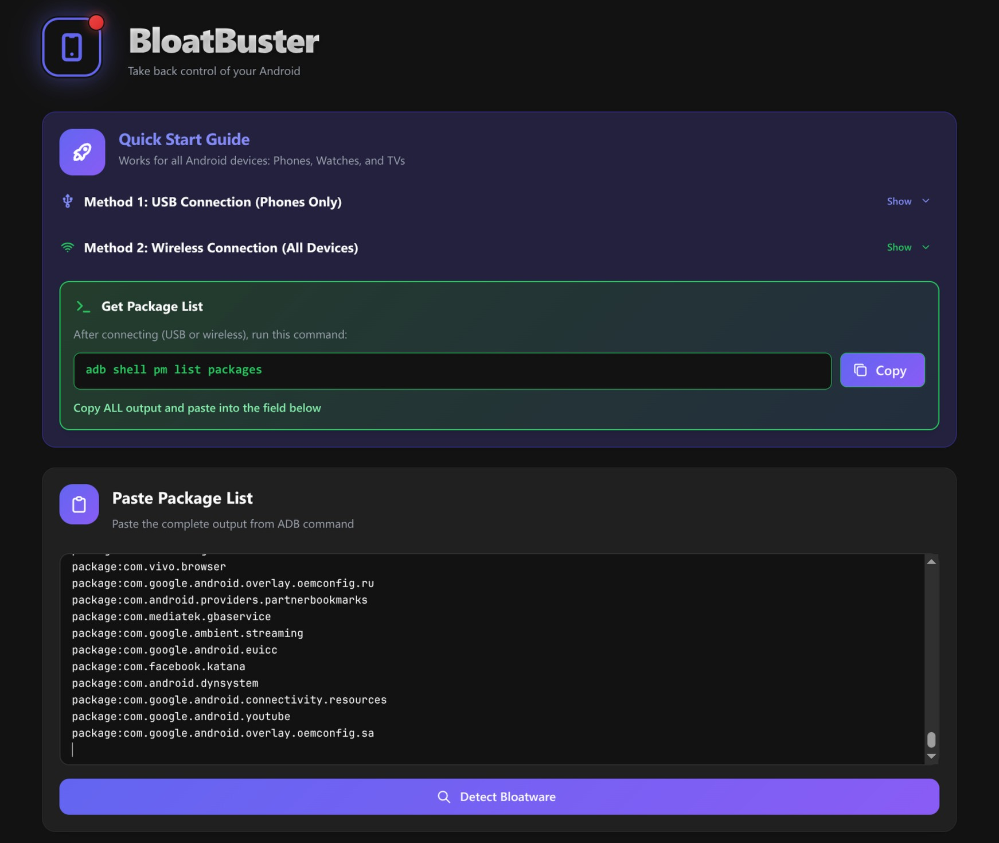
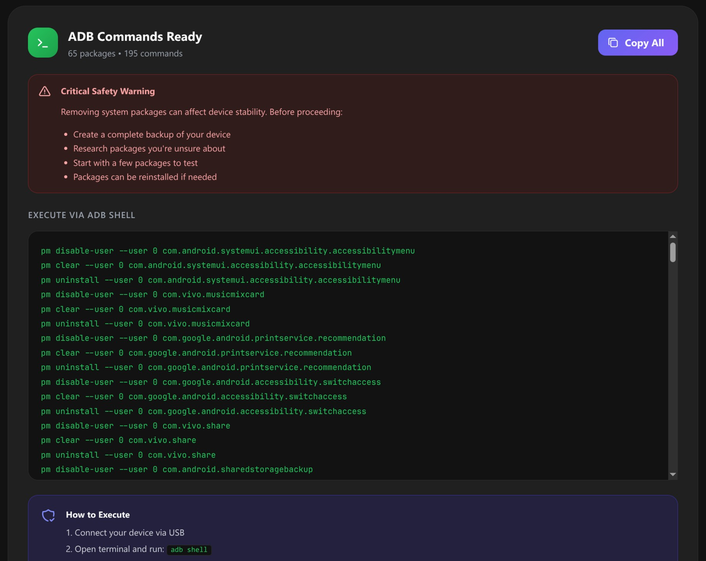

# 🧹 BloatBuster

**Take back control of your Android.**

BloatBuster helps you reclaim your device’s speed, privacy, and space. It scans your installed apps against a curated list of over 1,600 bloatware packages and gives you ready-to-use ADB removal commands so you can clean up your device with confidence.

[](https://opensource.org/licenses/MIT)
[](https://bun.sh)
[](https://reactjs.org/)
[](https://www.typescriptlang.org/)

<div align="center">
   

### 🚀 **[Use BloatBuster →](https://thongtech.github.io/bloatbuster/)**

[](https://thongtech.github.io/bloatbuster/)

No installation required • Runs in your browser • Privacy-first

</div>

## ❓ Why BloatBuster?

**Manufacturers and carriers pre-install dozens of unnecessary apps on Android devices.** Beyond consuming resources and cluttering your interface, many of these packages include advertisements, diagnostic tools, and unconsented telemetry that collect and transmit your data. These apps can't be uninstalled through normal means, leaving you with no control over what runs in the background.

**BloatBuster identifies these packages and generates removal commands**, giving you control over your device's privacy and performance. With 1,600+ packages in our database covering phones, watches, and TVs, you can confidently remove unwanted tracking and bloatware without risking system stability.

## ✨ Features

- 🎯 **Comprehensive Database** – 1,600+ recognised packages (~1,100+ legitimate apps, ~550+ bloatware) across phones, watches, and TVs from major manufacturers

- 🔒 **Privacy First** – Everything processes locally in your browser; no data ever sent to servers

- 🛡️ **Safety Ratings** – Each bloatware package rated as Safe, Caution, or Risky based on removal impact

- 📱 **Universal Device Support** – Works with Android Phones, WearOS Watches, and Android TVs from a single interface

- 📋 **One-Click Commands** – Generates ready-to-use removal commands with copy-to-clipboard functionality

### 📦 Package Categories

| Category                | Description                                                                        |
| ----------------------- | ---------------------------------------------------------------------------------- |
| 🏢 **Brand-Specific**   | Manufacturer bloatware (Samsung, Xiaomi, Google, etc.)                             |
| 🔧 **Chipset-Specific** | Hardware vendor packages (Qualcomm, MediaTek)                                      |
| 📦 **Generic**          | Common bloatware across multiple devices                                           |
| ⚠️ **Suspicious**       | Unrecognised packages not in our database (research recommended)                   |
| ✅ **Recognised**       | Legitimate apps and system packages (not bloatware, but can be removed if desired) |

### 🛡️ Safety Rating System

BloatBuster uses a three-tier safety rating system for bloatware packages:

- **🟢 Safe** – Safe to remove (bloatware, optional features, third-party apps)
- **🟡 Caution** – Review before removing (may affect specific features or UI elements)
- **🔴 Risky** – Advanced users only (critical system components that could break functionality)

### 📱 Supported Manufacturers

- **Samsung** – Galaxy One UI phones and watches
- **Xiaomi** – MIUI/HyperOS devices, POCO phones, and TVs
- **Google** – Pixel devices and Android One
- **Vivo** – Funtouch OS/OriginOS devices
- **Qualcomm** – Chipset-specific packages
- **MediaTek** – Chipset-specific packages
- **Carrier** – Network operator pre-installed apps
- **Generic** – Common bloatware across all devices

**Note:** The package database is based on devices and apps I've used over the past decade. It is not exhaustive and was originally developed for personal use.

## 🚀 Quick Start

1. **Open [BloatBuster](https://thongtech.github.io/bloatbuster/)** in your browser

2. **Paste your package list** into the text area (follow the on-site instructions to get your package list)

3. **Click "Detect Bloatware"** – BloatBuster will analyse your packages

4. **Review detected packages:**

   - Browse by category (Brand, Chipset, Generic, Suspicious)
   - Check safety ratings for each package
   - Use search to find specific packages
   <br>
   <div align="center">
      
   </div>

5. **Select packages to remove:**

   - Packages are pre-selected if they're known bloatware
   - **Important:** Carefully review all pre-selected packages before removal. These selections reflect my personal usage patterns and may not match yours — for example, I don't use Samsung Dex, PC connection features, Android Auto, or similar services. Uncheck any packages you want to keep.
   - Recognised legitimate apps are not selected by default
   <br>
   <div align="center">
      
   </div>

6. **Copy commands** and follow the on-site instructions to execute them

## 📦 Installation

### Prerequisites

- [Bun](https://bun.sh) (recommended) or Node.js 18+

### Setup

```bash
# Clone the repository
git clone https://github.com/thongtech/bloatbuster.git
cd bloatbuster

# Install dependencies
bun install

# Start development server
bun run dev

# Build for production
bun run build
```

### Accessing the App

- **Development**: http://localhost:5173
- **Production**: Build files in `dist/` directory

## 🔧 Development

### Adding New Packages

1. **For recognised packages** (legitimate apps): Add to `src/data/packages/recognised/`
2. **For bloatware packages**: Add to `src/data/packages/bloatware/`
3. **Package information** (optional but recommended): Consider adding package description to `src/data/metadata.ts` to provide users with better guidance

## 🤝 Contributing

Contributions welcome! Please open an issue first to discuss major changes.
